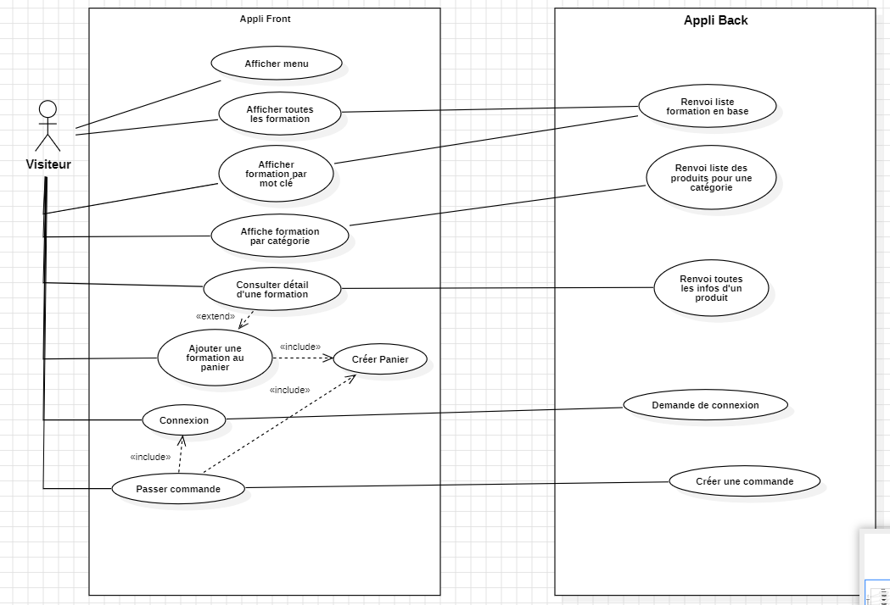
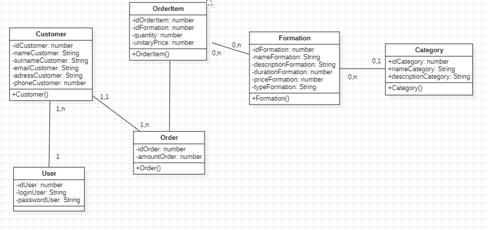
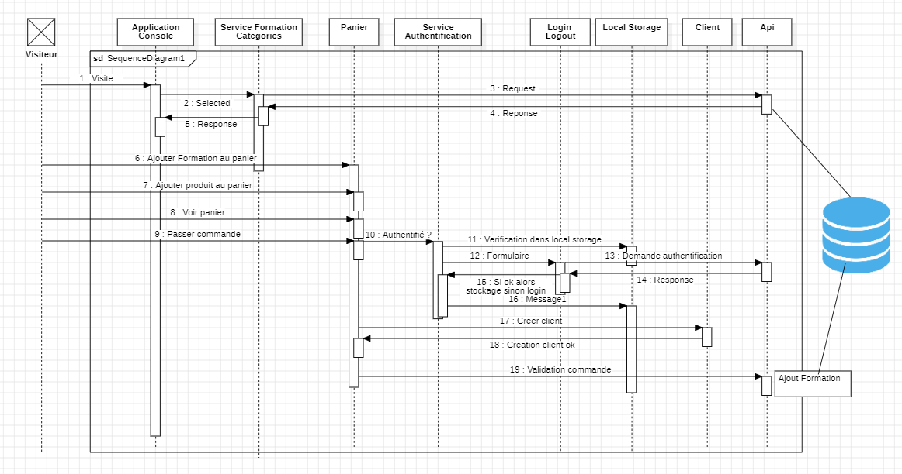
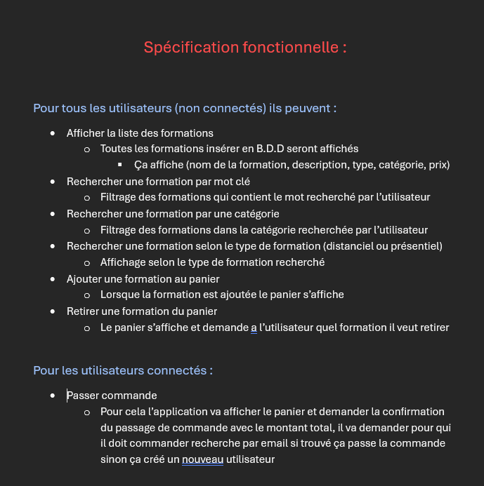

# Evaluation_1erePartie

# Le sujet de l'évaluation est de créer une application d'achat de formation

# Fonctionnalité : 

## Fonctionnalité 1 : Afficher toutes les formations
## Fonctionnalité 2 : Afficher les formations par catégorie
## Fonctionnalité 3 : Rechercher formation par mot clé
## Fonctionnalité 4 : Rechercher formation en présentiel
## Fonctionnalité 5 : Rechercher formation en distanciel
## Fonctionnalité 6 : Ajouter une formation au panier
## Fonctionnalité 7 : Retirer une formation du panier
## Fonctionnalité 8 : Passer commande
## Fonctionnalité 9 : Se connecter / Déconnecter

### 1. Diagramme de Cas d'Utilisation (Use Case)
Voici le diagramme de cas d'utilisation représentant les interactions principales du système avec les acteurs :

### 2. Diagramme de Classe
Le diagramme de classe montre la structure du système en termes de classes et de relations :

### 3. Diagramme de Séquence
Ce diagramme illustre la séquence d'interactions entre les objets et les acteurs dans le cadre d'un scénario particulier :

## 4. Spécifications Fonctionnelles

Voici un aperçu des spécifications fonctionnelles du projet :

